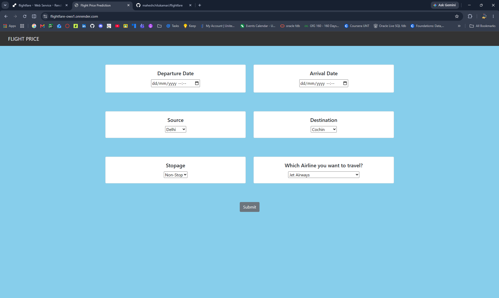
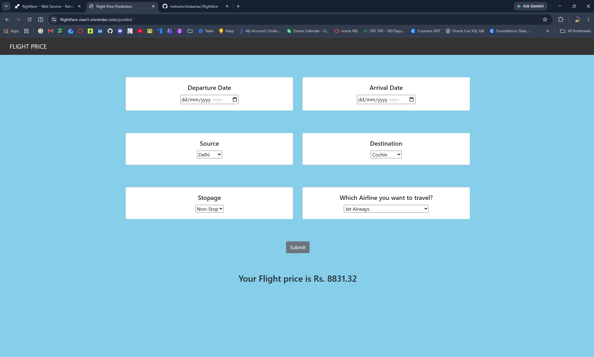

Deployment Link:

```text
https://flightfare-owx1.onrender.com/
```
# Flight Fare Prediction

A machine learning web application that predicts flight ticket fares based on user-provided journey details. The application uses a trained Random Forest Regression model and a Flask backend to generate fare predictions.

---

## Demo

### Home Page



### Prediction Result



---

## Project Overview

Flight ticket prices vary based on factors such as airline, source, destination, journey date, departure time, arrival time, and number of stops. This project predicts an estimated flight fare using a machine learning regression model trained on historical flight fare data.

The goal of this project is to help users estimate flight prices before booking.

---

## Features

- Predicts flight fare based on journey details
- Uses a trained Random Forest Regression model
- Flask-based backend
- Simple web interface using HTML, CSS, and Bootstrap
- Supports inputs such as airline, source, destination, travel date, time, and stops

---

## Tech Stack

- Python
- Flask
- Flask-CORS
- Scikit-learn
- Pandas
- NumPy
- HTML
- CSS
- Bootstrap
- JavaScript

---

## Project Structure

```text
FLIGHT-FARE-PREDICTION/
│
├── assets/
│   ├── demo1.png
│   └── demo2.png
│
├── static/
│   └── css/
│       └── styles.css
│
├── templates/
│   ├── home.html
│   └── login.html
│
├── app.py
├── flight_rf.pkl
├── Data_Train.xlsx
├── Test_set.xlsx
├── requirements.txt
├── Procfile
├── runtime.txt
├── .python-version
├── README.md
└── .gitignore
```

---

## Installation and Setup

### 1. Clone the repository

```bash
git clone https://github.com/maheshchilukamari/flightfare.git
cd flightfare
```

### 2. Create a virtual environment

```bash
py -3.10 -m venv venv
```

### 3. Activate the virtual environment

```bash
venv\Scripts\activate
```

### 4. Install dependencies

```bash
python -m pip install --upgrade pip setuptools wheel
python -m pip install -r requirements.txt
```

### 5. Run the application

```bash
python app.py
```

Open the application in your browser:

```text
http://127.0.0.1:5000
```

---

## Requirements

```txt
setuptools==68.2.2
wheel==0.41.2
Flask==2.2.5
Flask-Cors==3.0.10
gunicorn==20.1.0
joblib==1.2.0
numpy==1.23.5
scipy==1.9.3
pandas==1.5.3
scikit-learn==1.1.1
```

Recommended Python version:

```text
Python 3.10.13
```

---

## Deployment

This Flask application requires a Python backend server. It can be deployed using platforms such as Render.

### Render Configuration

```text
Build Command:
python -m pip install --upgrade pip setuptools wheel && pip install -r requirements.txt
```

```text
Start Command:
gunicorn app:app
```

Set the Python version:

```text
PYTHON_VERSION = 3.10.13
```

---

## Model

The trained model is saved as:

```text
flight_rf.pkl
```

The model uses Random Forest Regression to predict flight fares based on travel-related input features.

---

## Limitations

- Predictions are based on historical data.
- The application does not fetch live airline prices.
- Actual fares may vary due to demand, offers, holidays, and booking time.

---

## Authors

- Mahesh Chilukamari
- Akshay Reddy Vedulla
- Priyanka Kumari

---

## License

This project is developed for academic and learning purposes.
